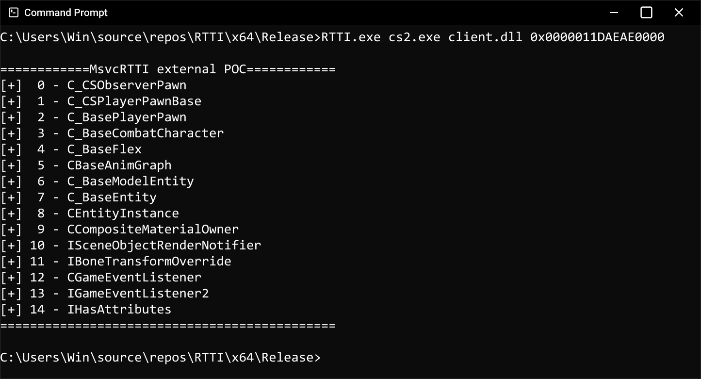

# MsvcRTTI

A lightweight, header-only library for parsing and extracting MSVC's RTTI (Run-Time Type Information) data structures from both local and external processes. Note that it supports
64-bits only.

## Features

- Header-only implementation - just include and use
- Support for both local and external process RTTI extraction
- Class name demangling
- Complete inheritance hierarchy extraction
- No external dependencies beyond standard C++ libraries and the Windows API

## Installation

Simply copy the `single_include/MsvcRTTI.h` header file into your project and include it:

```cpp
#include "MsvcRTTI.h"
```

## Usage

### Local Process RTTI Extraction

To extract RTTI information from objects in your current process:

```cpp
// Get the class name of an object
std::string class_name = MsvcRTTI::extractClassName(image_base, p_object);

// Get all base class names (inheritance hierarchy)
std::vector<std::string> base_classes = MsvcRTTI::extractAllBaseClassNames(image_base, p_object);
```

### External Process RTTI Extraction

For extracting RTTI information from objects in another process:

```cpp
// Get the class name from an external process
std::string class_name = MsvcRTTI::extractClassNameExternal(process_handle, image_base, p_object);

// Get all base class names from an external process
std::vector<std::string> base_classes = MsvcRTTI::extractAllBaseClassNamesExternal(process_handle, image_base, p_object);
```

## Example Output

Here's an example of extracting class hierarchy information from a game process:



The figure above shows a successful extraction of the complete class hierarchy from a Counter-Strike 2 object of a player pool.

## Technical Details

The library provides structures for parsing MSVC's RTTI data:

- `CompleteObjectLocator`: Contains information about object layout and type information
- `ClassHierarchyDescriptor`: Describes inheritance attributes and base class information
- `BaseClassDescriptor`: Contains information about individual base classes
- `TypeDescriptor`: Holds the mangled class name and virtual function table information

## Limitations

- Maximum RTTI name length for external extraction is limited to 256 characters by default (configurable via `MAX_RTTI_NAME_LENGTH`)
- Requires RTTI to be enabled in the target application
- Windows-specific implementation for external process memory reading
- Support 64-bit applications only

## Contributing

Feel free to open issues or submit pull requests for any improvements or bug fixes.

## License

This project is open-source and available under the MIT License.